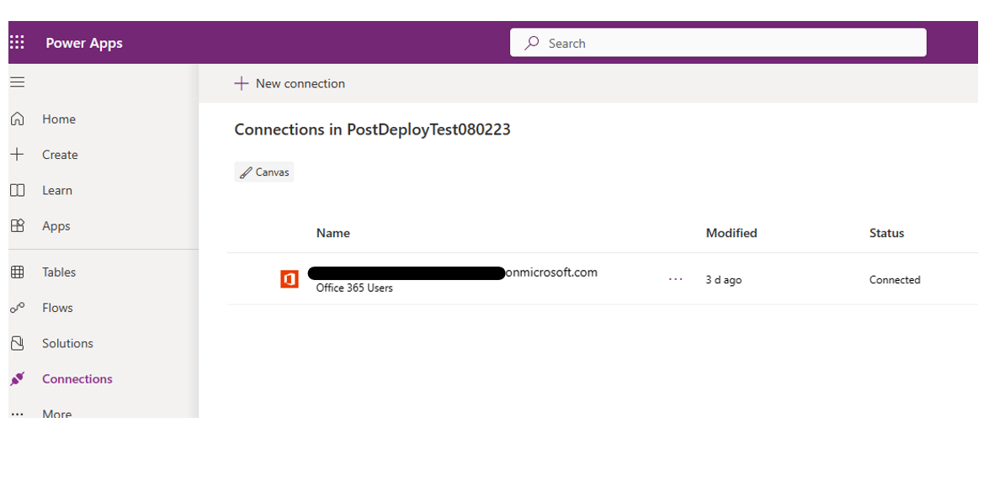
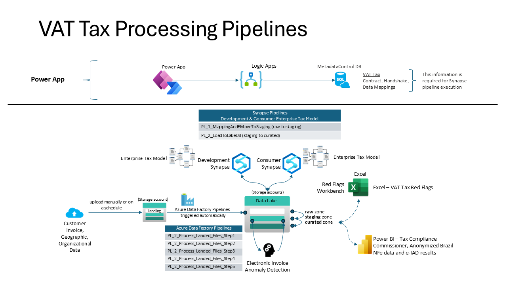

# ACTS Business Use Case Portal Deployment and Use

Follow these steps to deploy and configure the ACTS Business Use Case Portal Power App. See the [VAT Tax Processing Pipelines](#vat-tax-processing-pipelines) section below for the context for using this Power App.

1. Download the zip file from [this repository](./BusiessUseCasePortal_20230928145456.zip).

    

2. Open the Power App environment. This environment is set up and supplied by the customer. From your browser log into your Microsoft account profile then access the Power Apps environment [at this URL](https://make.powerapps.com/).

3. Add the following connection to the environment:

    - Microsoft 365 users connection - authenticate as admin of power platform (service account).

    

4. Select the Apps tab in the left navigation and then Import Canvas App that you downloaded locally, using the button in the header.

    

5. Select the upload button and navigate to the location of the package file from this repository.

    

6. On this screen, you can rename the app before it is added to the environment. Select the ‘wrench’ icon to change settings.
**Note that the flows needed to communicate with the Logic Apps are deployed with the app.**

    

7. The next step is to enable the flows. Navigate to the Flows section and notice that the flow is greyed out. This is because it is deployed in a disabled state. We must enable it for the solution to work.
Click the triple dots and select ‘Turn on’.

    

8. Next, obtain the URI address from the Logic App. We must get the endpoint address of the Logic App and copy it first.

    - Navigate to the Logic App resource group in the subscription.
    - Open the DataContractIngestion Logic app.

    

9. Edit the Logic App in Designer mode

    

10. Next edit the URI address that points to the Logic App. Start by editing the flow. You will need to navigate back to the Power Apps environment.

    

11. Select the HTTP connector and paste the value copied from the Logic App in step 10.

    

12. Save the Power Automate Flow

    

13. Repeat step 8 through 12 for each of the Power App Flows-Logic App pairs shown in the table below.

    | Flowname | LogicApp called | Description |
    | --- | --- | --- |
    | getMappingRecords | getMappingRecords | queries the mapping table |
    | getPatternData    | getPatternData    | queries the pattern table |
    | DataContractMappingSubmit | MappingServiceIngestion | InsertDataMapping |
    | getDataContract | getDataContract | queries the DataContract table |
    | GetSchemaSynapsedb | getSynapseTable | queries the information_schema.columns query  |
    | schema | getSchema | dbo.schemaDynamic (serverless) |
    | getHandshakeRecords | getHandshakeRecords | queries the dbo.handshake table  |
    | getFromControl | getlistFromControlTable | Queries the IngestedLandingDataAudit |
    | HandshakeSubmit | handshakeSubmit | usp_InsertHandshake |
    | getDatabases | getDatabases | Query: SELECT * FROM sys.databases  |
    | DataContractSubmit | DatacontractSubmit | usp_InsertDataContract |
    | DataContractEdit | DataContractEdit | usp_EditDataContract |
    | getDataAssetTechnicalValues| getNewDataContract |  usp_getDataContractRecordsDynamic |

    Now the required connections have been configured for the Power App and Flows.

14. Navigate to the Power App and Edit.

    

15. The first time this is edited, you will be prompted to enable the needed connections. The system will install this as the user that is currently logged in, so be sure it is with the service account or admin account so that the connector will work for all users.
Click allow.

    

The ACTS Business Use Case Portal Power App now is configured to allow data registration into the meta-data control table.

## Using the Business Case Portal

There are 4 steps in application of the Business Use Case Portal for configuring data to be ingested and analyzed in the ACTS VAT Tax Accelerator.

1. Create a ***Data Contract*** - a Data Contract and Auto-generate the ***Handshake Service***.

A Data Contract is an agreement between a service provider (the Azure services we deploy are the services) and data consumers (customers and partners) that determines the management and intended usage of data between different organizations, or groups within an organization. The aim is to ensure reliable and high-quality data that can be trusted by all parties involved. Data Contracts allow a service to define the entities they own, along with the schema, semantics, and various rules and thresholds such as those for data quality applicable to the data set defined in the contract.

A Handshake Service tracks and manages what and when data is published. This is the service used by the publisher to define specific information needed for the ingestion of data. It’s a job service that tracks and manages details needed for the automated data transfer from the source data to the data lake.

From the  [Power Apps, Apps page](https://make.powerapps.com/), click on the Business Use Case application and when the application completes loading, press the 'Play' button at the top right to start the application and display the landing page.

Click the 'Access this service' button on the 'Data Acquisition Toolkit' panel to display the Data Acquisition Toolkit page.

Click 'Access this service' on the 'Data Contract and Shared Service' panel to display the Data Contract and Shared Service page.

Next, click the 'Create New Data Contract' button at the top right to display the 'Data Contract view Edit' page.

Fill in as many fields as possible in the form above. Note that the following fields are required:

- Subject Area,
- Data Source Name (Friendly),
- Pattern -only 'Delimited Text' is supported,
- Delimited File Name - use the example data to test, and
- Delimiter Name - only 'comma' is supported.

Click 'New Handshake' to create the data contract and display the Handshake Service information page.

Click 'Submit' to add the new Data Contract and Handshake Service information the meta-data database.

3. Define the ***Data Mapping*** - The Data Mapping defines how attributes or fields in the input data map to fields in the Enterprise Tax Model.

Click the Home button on the Power App, then click 'Access this service' button on the 'Business Use Case Toolkit' panel to display the Business Use Case Toolkit page.

Now click 'See more' in the VAT TAX panel, and in the VAT TAX page, click 'See More' in the 'Invoice' panel.

In the 'VAT TAX Data' window, select the 'false' checkbox and in the 'Mapping Shared Service' window select 'EnterpriseTaxModel' for the Synapse Database, and 'Invoice' from the 'Select Table Name' drop-down list.

In the pane on the right, select the fields from the EnterpriseTaxModel to which the input (Invoice) data will be mapped. All fields are selected by default. When the fields have been selected click the 'Next' button to display the 'Mapping Shared Service Source' page.

In the Mapping Shared Service Source page, click the refresh icon next to the 'Select from ingested files in the raw container' drop-down list and select the file containing data of the type specified in the 'Select Table Name' of the previous (Mapping Shared Service) window. For example if you are mapping Invoice data, then 'invoice' was selected from the 'Select Table Name' drop-down list and a data file containing ingested Invoice data is selected from the 'Select from ingested files in the raw container' drop-down list.

Select 'comma' for the delimiter of the csv file.

Once the ingested data file and delimiter are specified, click the refresh icon at the top left of the pane at right and the ingested data file will be parsed to obtain a list of the fields in that file. The fields of the ingested file will be displayed at right and the fields available in the EnterpriseTaxModel will be displayed at left as shown below.

In the right-hand pane, select the fields that will be mapped and note that the maximum number of fields selected cannot exceed the number of fields available in the corresponding table of the EnterpriseTaxModel shown in the pane on the left-hand side.

Click the 'Next' button to display the 'Mapping Shared Service Final' window.

In the 'Mapping Shared Service Final' window, the fields selected in the previous window will appear in the list on the left-hand side, and the (not editable) fields available in the EnterpriseTaxModel will appear on the right-hand side. Pair the fields as appropriate to specify the mapping of ingested data fields to EnterpriseTaxModel fields, then click 'Submit Mapping' to create the mapping file.

4. Trigger the ***Ingestion Service*** - the Ingestion Service applies information from the Data Contract, Handshake Service, and Mapping Service to configure the ingestion pipelines for publishing of data to the data lake. The Ingestion Service eliminates the need to develop code that delivers quality data to the data lake. The necessary staging and processing pipelines are provided by the Ingestion Service.

As a final step, complete the [Functional Test](../../README.md) section and complete each step using the sample data provided. See the section below for more information about the processing pipelines.

## VAT Tax Processing Pipelines

The VAT Tax processing pipeline is shown in the image below. Depicted at the top is the Business Use Case Portal Power App described herein. This Power App is designed to simplify the configuration of information, including Contract, Handshake, and Data Mappings, required for the Synapse pipeline execution.

Depicted on the lower half of the diagram are the pipeline processes. When data are uploaded to the landing zone storage account, Azure Data Factor pipelines are triggered automatically to convert and store the data in parquet file format in the raw zone. These data remain in the raw zone until you trigger the Synapse pipeline 'PL_1_MappingAndMoveToStaging', which automatically triggers pipeline 'PL_2_LoadToLakeDB'. These pipelines move the data from raw to staging to curated zones, where they are available to business consumers of the data in Excel, Power Bi line of business applications.
