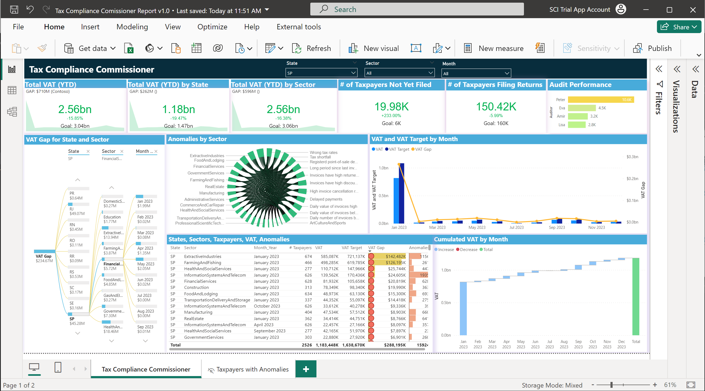

# Downloading and Using the Tax Compliance Commissioner Report

A Power BI report has been created for the ACTS VAT Tax Accelerator, preloaded with public and synthetic data that you can view to understand better the kind of information that can be obtained from this VAT tax solution.

## Introduction

The Tax Compliance Commissioner Report displays a summary of ACTS VAT Tax Accelerator data and results that are relevant to management of tax revenue. This includes VAT tax collections for the year, by State, by Sector, by month, and VAT gap data to get a quick understanding of where tax revenue shortfalls occur. Anomalies recorded from analysis of electronic invoices are summarized with other data in a table that includes a visualization of the anomalies by taxpayer.

## Prerequisites

- The latest Power BI Desktop application.
  - You can download and install the latest version from [this link](https://powerbi.microsoft.com/en-us/desktop/?WT.mc_id=Blog_Desktop_Update).
- A deployed ACTS Tax Accelerator.
  - You can start quickly by viewing the provided sample data. When you want to connect to your own data then the VAT Tax Accelerator must be deployed and the Enterprise Tax Model populated with data.

## Configuration

Follow these steps to download and configure the ACTS VAT Tax Accelerator report:

1. Download the Tax Compliance Commissioner Power BI report in this directory.
2. Open the report in Power BI Desktop.

You can examine the preloaded data set, or connect to your own data by following these steps:

1. In the Power BI Data pane, select Edit Query on any of the tables to open the Power BI Query Editor window.
2. Select queries from the Queries panel at left to set the following 2 parameters:
    - **Server_Name** - this must be the name of your Consumer Synapse 'Serverless SQL endpoint'. You can find this value on the Overview page for the Consumer Synapse in the Azure Portal.
    - **DB_Name** - this value is "EnterpriseTaxModel", the default name for the curated tax data model, or the name you set for this database.
3. Add the data in [AdditionalData.xlsx](./AdditionalData.xlsx) to create the TaxpayerSector, AnomalyResults, TaxAnomalyTypes and States tables to the report. It is recommended that these data tables be added to the Enterprise Tax Model; however, they can be loaded separately as an Excel workbook.

With the changes in the preceding 3 steps, update the Power BI reports (Close & Apply, or Refresh Data) with data from your tax model. If you have a Power BI Pro account, you can publish the report online for access via the web.