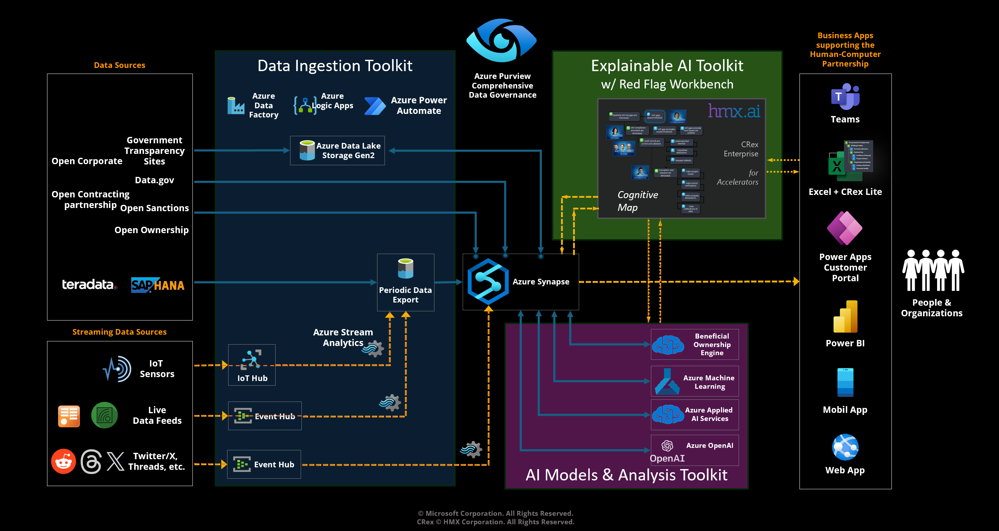

# ACTS VAT Tax Accelerator

Access to the ACTS VAT Tax Accelerator is by invitation.

The ACTS VAT Tax Accelerator includes the following capabilities:

1. **Data Management Infrastructure** - a comprehensive data strategy implementation including data ingestion, Azure Data Factory pipelines, Azure Synapse deployments including pipelines for development (staged) and consumer (curated) data management with associated storage containers, and a common Enterprise Tax Model (ETM).
    - The deployment includes the [Business Use Case Portal](DeliveryIP_GitHub/BusinessUseCasePortal), a Microsoft Power App that enables users and developers to establish data contracts, map raw data to ETM fields and ingest raw data into the ETM.
2. **Power BI Templates** - for visualization of tax compliance information and results of analysis performed by the ACTS VAT Tax Accelerator.
3. **Example Data** - for testing all of the accelerator capabilities.

In addition, the following capabilities can be deployed with the VAT Tax Accelerator. Test data and preprocessing pipelines specific to VAT Tax Accelerator implementation also are provided.

1. **Red Flags Workbench** - Excel-based review flags exploration and simulation.
2. **Information Assistant** - Enhanced generative AI supporting query of private organizational knowledge in a secure manner.
3. **Electronic Invoice Anomaly Detector** - Electronic Invoicing Anomaly Detection (e-IAD) algorithms that applies machine learning to detect anomalies in e-Invoicing data.

The steps required to deploy the ACTS VAT Tax Accelerator solution including example data and tools are described below.

## Deploy Data Management Infrastructure & Development Synapse

The [deployment document](DeliveryIP_GitHub/) provides step by step instructions on how to deploy the data management infrastructure and Development Azure Synapse components. All required services, with developer access, will be in place after deployment. This allows immediate access to the services including those for data ingestion, data processing, and visualization with Power BI reports. Developers with knowledge of Azure Synapse, Azure Data Factory, and Power Platform can easily tailor the VAT Tax Accelerator to fit their specific use case needs. The Development Synapse includes pre-packaged data pipelines that move uploaded data from the "landing" storage container (or "zone") of the data lake to the development VAT Tax ETM in the "staging" zone. The ETM in the staging zone provides access for developers and data scientists, with the necessary permissions, for analysis, machine learning modeling, and other types of exploratory inspection and analysis.

## Deploy Consumer Synapse

The next step is to deploy a separate Consumer Synapse compute environment with the common VAT Tax ETM and populate the ETM with test data ([see instructions here](DeliveryIP_GitHub/consumers/acts/)). The Consumer Synapse includes pre-packaged data pipelines that move ingested data from the staging zone of the data lake and map it to the ETM in the "curated" zone, which is the database of record. Data in the curated zone are used, with the necessary permissions, by management, business intelligence teams, and other data consumers for reporting, and processing external to the VAT Tax Accelerator environment.

## Functional Tests

After deploying the Infrastructure, Development Synapse, and Consumer Synapse you can validate the solution performance by following these steps.

1. Download the [InvoiceSampleData zip file](SampleData/) and complete the following:

2. Unzip the downloaded zip file and place the sample CSV files into a new folder (any convenient folder name can be used) in the "landing" zone storage container.

    - Azure Data Factory pipelines will be triggered as soon as the files are uploaded to the landing zone. These pipelines move the sample data files into a folder structure in the raw zone, matching the files to entries in a meta-data control table (see the Power App capabilities described here for information on creating the control data tables). The meta-data control table entries for the sample data are provided in the deployment and include information needed to map the data to the ETM.

3. Use Azure Data Factory Studio Monitor to confirm that the pipelines have successfully completed.

4. In the Development Synapse, trigger pipeline **PL_1_MappingAndMoveToStaging**. This pipeline, which automatically triggers pipeline **PL_2_LoadToLakeDB**, moves the ingested data from the raw zone to the staging zone and populates the ETM in both the Development and Consumer Synapse instances.

The sample data are now ready to be accessed by Power BI from the Consumer Synapse ETM.

## Download the PBI Desktop Files

The Tax Compliance Commissioner Power BI report is parameterized to connect to the ETM in the Consumer Synapse. Information on downloading and using the report can be found in the [DemoReports](DemoReports/README.md) folder.

### Add Multi-language Support

ACTS Accelerators includes methods and tools to support multiple languages in Power BI reports. These methods enable users to modify labels on visuals, add languages, and manage these labels and languages to tailor reports in specific implementations. The steps to deploy multi-language support for this Accelerator can be found in the [MultiLanguageSupport](MultiLanguageSupport/) folder. This folder includes a document with deployment steps and an example Power BI file that implements multi-language capabilities described in the document.

## Additional Accelerator Capabilities

The ACTS VAT Tax Accelerator components support the following additions, which can be deployed separately.

### Red Flags Server and Excel Workbench Add-in

The Red Flags Workbench is a Microsoft Excel Add-in designed to allow managers and analysts to explore standard procurement red flags available in a library that is based on the [Open Contracting Data Standard](https://www.open-contracting.org/data-standard/), create their own red flags, modify how red flags are assessed, and perform simulations scenarios with a subset of their procurement data. The Add-in applies the familiar capabilities of Excel so that business users can easily create and maintain their red flags. The Add-in's Cognitive Map structure provides a context for organizing red flags in a way that keeps organizations focused on goal achievement and maintaining procurement compliance situational awareness. See [Red Flags Workbench Installation and Use](RedFlagsServer_and_Workbench/README.md) for information on deploying the workbench for use with the ACTS Procurement Accelerator.

### Information Assistant

The ACTS Information Assistant applies the [Microsoft Public Sector Group's Information Assistant](https://github.com/microsoft/PubSec-Info-Assistant) to enable use of OpenAI large language models for data retrieval and ChatGPT-style Q&A interactions in a secure manner with a tax authority's private information. The Information Assistant uses  Retrieval Augmented Generation (RAG) with Azure OpenAI's GPT models and Azure AI Search to discover relevant responses to user queries through simplified data ingestion, transformation, indexing, and multilingual translation services. Tax authorities that deploy this capability can upload PDF, CSV, Excel, and image files and then engage in Q&A sessions relevant to the content of the private data. The Information Assistant is designed to address specific concerns of organizations that require natural language capabilities that are:

- **Current**: Based on the latest private data updates.
- **Relevant**: Responses tailored to the content of the uploaded private data.
- **Controlled**: Adjusted responses to provide the desired level of detail.
- **Referenced**: Provides citations from the uploaded knowledge sources.
- **Personalized**: Responses adjusted to your selected persona.
- **Explainable**: Provides information on the thought process that generated the response.

See [Information Assistant Installation and Use](InformationAssistant/README.md) for information on deploying the Information Assistant for use with the ACTS VAT Tax Accelerator.

### Electronic Invoice Anomaly Detector

The ACTS VAT Tax Accelerator applies the Microsoft Public Sector Group's [Electronic Invoice Anomaly Detector (e-IAD)](https://github.com/microsoft/eIAD) to enable detection of unusual electronic invoices supported by the ACTS VAT Tax Accelerator. e-IAD 1.0 builds on the expert knowledge of business representatives from tax agencies represented by the [Inter-American Center of Tax Administrations or CIAT](https://www.ciat.org/). e-IAD provides the following key capabilities:

- Standardized e-Invoicing and taxpayer-profile data schemas.
- A Data Quality Index to assess the quality of ingested data.
- Fully automated Unsupervised machine learning pipeline designed for e-Invoicing data.
- More than 50 features engineered from known risk e-Invoicing patterns.
- Ability to create, and examine example, dashboards for visualization and interpretation of results.
- An Anomaly detection Index to facilitate prioritization of detected anomalies.
- Interpretation of features that influence the anomaly index.
- Embedded interactive tools to do a deep analysis of e-invoicing data.

See the [e-IAD GitHub Repository](https://github.com/microsoft/eIAD/tree/main) for information on deploying the e-IAD for installation and use instructions.

## Open PEPPOL and UBL Support
Example data and supporting code described in this repository apply [Brazil's electronic invoiceing and related standards](https://www.nfe.fazenda.gov.br/portal/principal.aspx) for streamlining B2G, B2B, and B2C  financial transactions exchanges between buyers, seller, and governments. THe Pan-European Public Procurement On-Line organization, or PEPPOL is an international non-profit organization that enables any organisation to send and receive standard business documents, including electronic invoices based on the [OASIS Universal Business Language (UBL) standard](https://docs.oasis-open.org/ubl/UBL-2.4.html). The applications described in this repository can manage invoices and other electronic documents defined in the PEPPOL/UBL standard, providing a layer of analytics that improve transparency and compliance. See the [PEPPOL and UBL Support document](./PEPPOL_UBL/README.md) for more infomation about implementing VAT Tax Accelerator capabilities with PEPPOL electronic documents.

## Contributing

This project welcomes contributions and suggestions.  Most contributions require you to agree to a Contributor License Agreement (CLA) declaring that you have the right to, and actually do, grant us the rights to use your contribution. For details, visit <https://cla.opensource.microsoft.com>.

When you submit a pull request, a CLA bot will automatically determine whether you need to provide a CLA and decorate the PR appropriately (e.g., status check, comment). Simply follow the instructions provided by the bot. You will only need to do this once across all repos using our CLA.

This project has adopted the [Microsoft Open Source Code of Conduct](https://opensource.microsoft.com/codeofconduct/).
For more information see the [Code of Conduct FAQ](https://opensource.microsoft.com/codeofconduct/faq/) or
contact [opencode@microsoft.com](mailto:opencode@microsoft.com) with any additional questions or comments.

## Trademarks

This project may contain trademarks or logos for projects, products, or services. Authorized use of Microsoft trademarks or logos is subject to and must follow
[Microsoft's Trademark & Brand Guidelines](https://www.microsoft.com/en-us/legal/intellectualproperty/trademarks/usage/general).
Use of Microsoft trademarks or logos in modified versions of this project must not cause confusion or imply Microsoft sponsorship. Any use of third-party trademarks or logos are subject to those third-party's policies.
